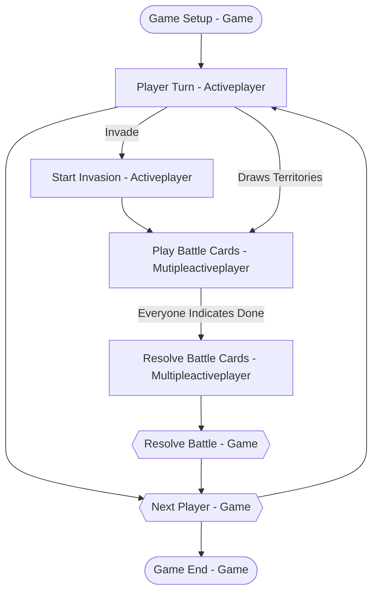

# State Machine Brainstorming

It seems that setting up the state machine is one of the foundational pieces of creating a game. Here's a first stab at a high-level flow for the game's state machine. I think we'll probably need to add more states when we address the specifics of the special cards (e.g., add a "Which card should the sniper target?" state, a "Which card would you like to pull from the discard pile?" state, etc.), but that's tomorrow's problem. :)

